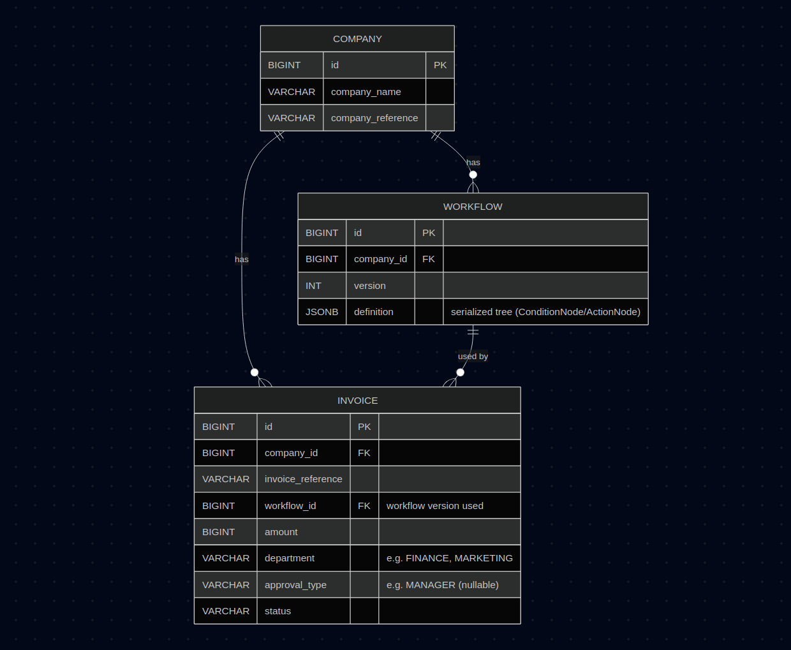

# Approval workflow Solution

### How to build & run
```sh
./gradlew clean build
./gradlew run --console=plain
```
This will start a CLI interface which will allow you to add and review invoices
### Db Design


### pre-loaded workflow
